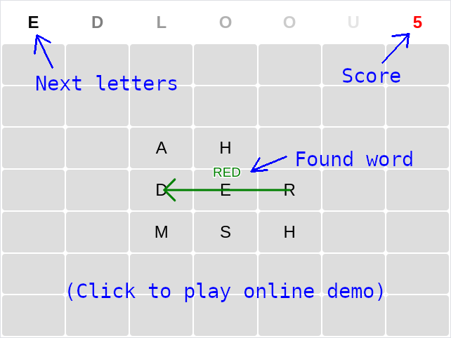

# game-word-puzzle

Crossword-like web puzzle game, create English words in 4 directions and fill entire area. Place letters that appears on the top of the screen anywhere, when you create English word you get one point, otherwise you lose one point.

The game works in Chrome and Firefox and on mobile (Android). It is written in vanilla javascript (~750 LOC, 24kB + 300kB words list) and uses HTML Table and Canvas for rendering.

How to play: Fill entire table by placing letters. When you create English word in any direction (left, right, up, down) you get 1 point, if you don't create word you lose 1 point. If your points drop to zero it's game over.

### My other games

- [Alien invasion](https://github.com/dvhx/game-alien-invasion) - 2D bullet hell alien shooter, collect credits and upgrade your ship
- [Balloon mountains](https://github.com/dvhx/game-balloon-mountains) - pop balloons while flying over misty mountains
- [Beach volleyball](https://github.com/dvhx/game-beach-volleyball) - play beach volleyball against opponent using swipe up gesture (or mouse)
- [Ghost car challenge](https://github.com/dvhx/game-ghost-car-challenge) - WebGL 3D game where you compete against "ghost drivers", uses tilt sensor on mobile phones (Android)
- [Ghost chat bot](https://github.com/dvhx/game-ghost-chatbot) - chat with very simple chatbot, no LLM!
- [Ghost town](https://github.com/dvhx/game-ghost-town) - 2D top-view pixel art web game where you walk and talk with various NPCs and solve quests
- [Ghost town 2](https://github.com/dvhx/game-ghost-town-2) - fight monsters and solve quests, non-talking sequel to ghost town game
- [Hide and seek](https://github.com/dvhx/game-hide-and-seek) - 2D top-view pixel art hide and seek game with a flashlight effect
- [Robot puzzle](https://github.com/dvhx/game-robot-puzzle) - control robot using simple instructionsto solve logical puzzles
- [Trash everything](https://github.com/dvhx/game-trash-everything) - destroy furniture in 2D pixel art levels
- [Virtual boyfriend](https://github.com/dvhx/game-virtual-boyfriend) - talk with cute virtual boyfriend, buy clothes, visit locations, play mini games

### Support

You can support development on [Patreon](https://www.patreon.com/DusanHalicky) or you can hire me via [Upwork](https://www.upwork.com/freelancers/~013b4c3d6e772fdb01)

